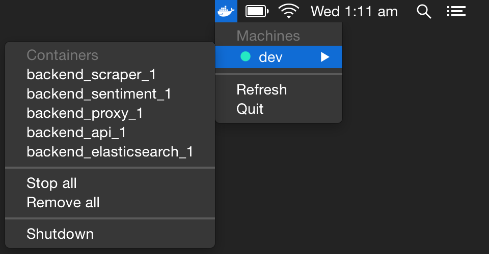
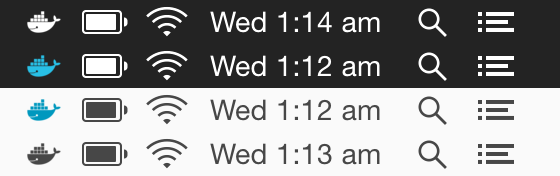

# docker-menu

> Menubar app for Docker built on Electron





## Installing

Download the appropriate file from [Releases](https://github.com/rdsubhas/docker-menu/releases). We're working on the auto-updater.

## Building

Run the following commands in the cloned source directory:

* ```npm install```
* ```npm run grunt```

The resulting .app file will be placed in a ```build/``` subdirectory.
